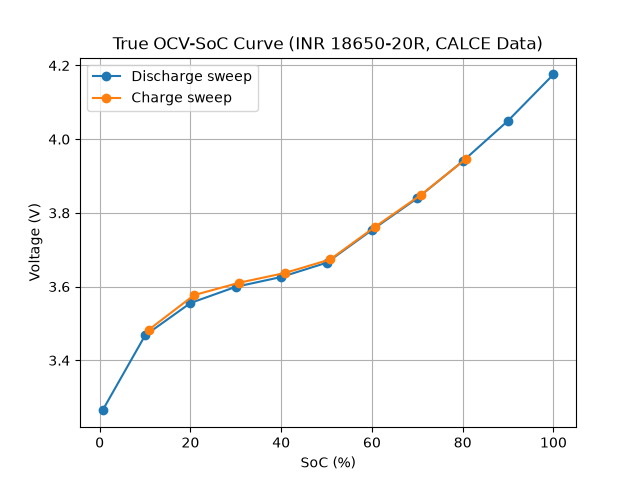

# EV Battery True OCV-SoC Characterization

Building a rest-period-based Open Circuit Voltage (OCV) to State of 
Charge (SoC) curve for a Li-ion battery — a follow-up to an earlier project 
that used a load-voltage approximation ("quasi-OCV") due to lack of 
rest-period data.

## 1. Motivation

A previous project (Coulomb counting + SoC estimation using NASA's battery 
dataset) approximated OCV using voltage measured under constant discharge 
current, since that dataset contained no rest periods. This project uses a 
dataset specifically designed for OCV characterization, allowing true 
rest-voltage measurements instead of an approximation.

## 2. Dataset

CALCE (University of Maryland) Incremental Current OCV test, INR 18650-20R 
cell (2000 mAh, NMC/Graphite), tested at 25°C.

**Test protocol:** charge to 4.2V at 1C, hold at constant voltage until 
current drops to 0.01C, then step down through SoC in ~10% increments via 
discharge pulses, each followed by a 2-hour rest period. The same process is 
repeated in reverse (charge pulses) to sweep back up through SoC.

## 3. Method

- Loaded and combined three channel sheets from the raw Excel export into 
  one continuous dataset (142,121 rows)
- Identified 19 distinct rest periods by detecting contiguous blocks of 
  near-zero current
- Extracted the voltage at the end of each rest period (most settled 
  reading, closest to true OCV)
- Converted cumulative charge/discharge capacity at each point into SoC, 
  using the cell's rated capacity (2.0 Ah)

## 4. Results

The curve shows the expected Li-ion S-shape: steeper near 0% and 100% SoC, 
flatter in the 20-80% middle range.

**Hysteresis observed:** the discharge-direction curve and charge-direction 
curve do not fully overlap — a small but consistent voltage difference 
exists between the two directions at similar SoC levels, most visible at 
low SoC (0-20%). This is a well-documented Li-ion phenomenon and confirms 
the data captures real cell behavior rather than an idealized curve.

## 5. Limitations

- Data covers only one cell sample at one temperature (25°C); OCV-SoC 
  relationships can shift somewhat with temperature and cell aging
- 19 data points give good but not exhaustive resolution; finer SoC 
  increments would sharpen the curve, particularly in the steep edge regions

## 6. Next Steps

- Build a lookup function to interpolate SoC from a given voltage (and vice 
  versa) using this curve
- Fuse this true OCV data with the Coulomb counting method from the earlier 
  project
- Explore an Extended Kalman Filter (EKF) combining both methods for a more 
  production-realistic SoC estimator